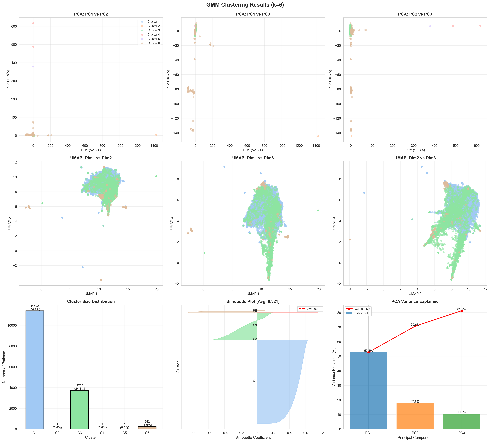
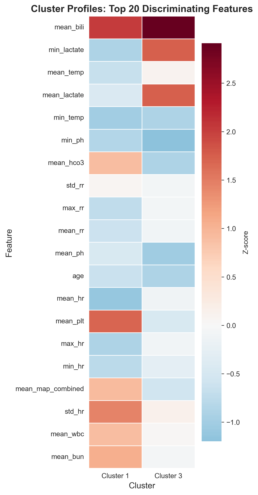
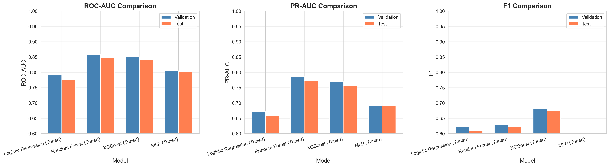
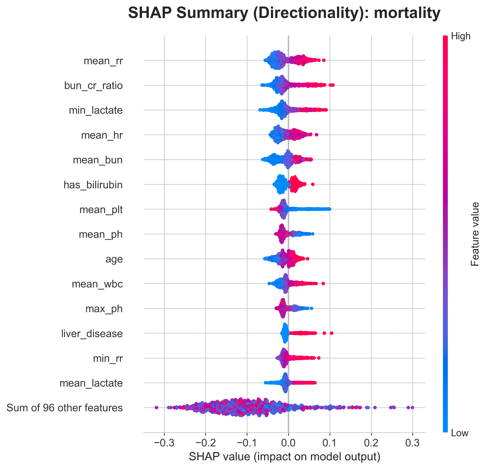
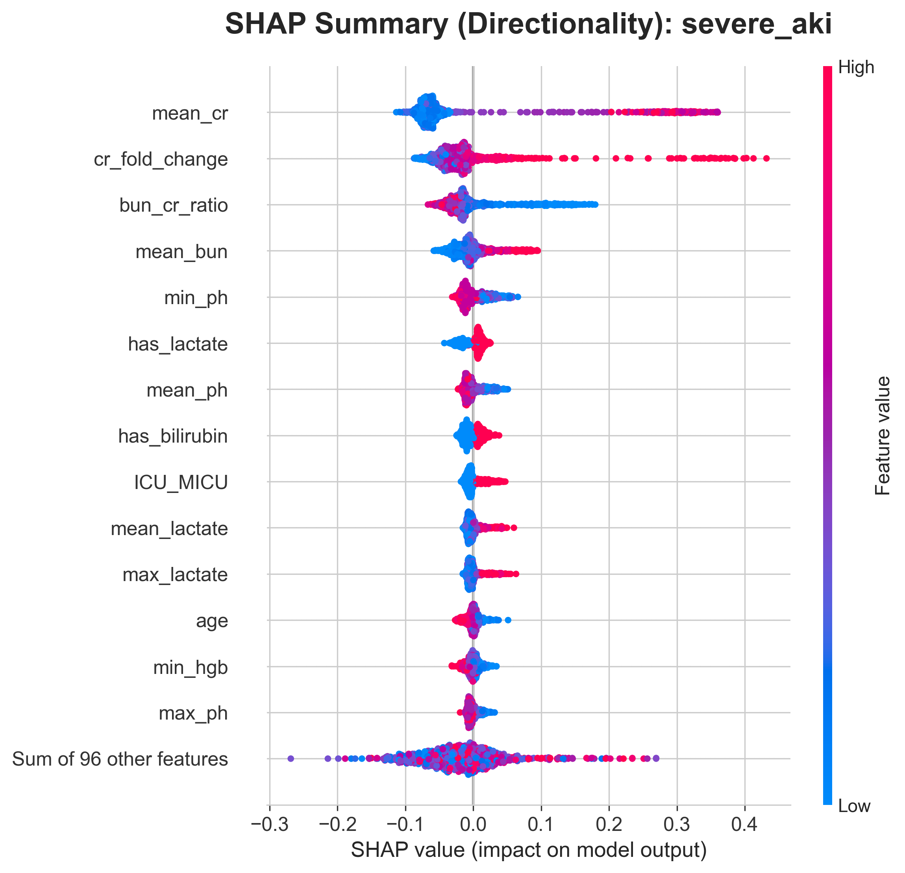

# AKI Phenotype Discovery and Outcome Prediction in MIMIC-IV

[](https://www.python.org/)
[](https://scikit-learn.org/)
[](https://xgboost.readthedocs.io/)
[](https://shap.readthedocs.io/)
[](https://umap-learn.readthedocs.io/)

A comprehensive machine learning pipeline for discovering distinct acute kidney injury (AKI) phenotypes and predicting clinical outcomes using the Medical Information Mart for Intensive Care (MIMIC)-IV database.

## Overview

This project implements two machine learning approaches to understanding AKI in critically ill patients:

1. **Unsupervised Clustering**: Discovers distinct AKI phenotypes based on clinical features from the 24 hours following AKI onset.
2. **Supervised Prediction**: Predicts severe outcomes using features from the 24 hours prior to AKI onset.

---

## Dataset overview

- **Source**: MIMIC-IV v3.1
- **AKI Definition**: KDIGO creatinine criteria
  - Criterion 1: ≥0.3 mg/dL increase within 48 hours
  - Criterion 2: ≥1.5× baseline within 7 days
- **Inclusion Criteria**: 
  - ICU stay ≥48 hours
  - Valid baseline creatinine (first measurement within 24h of ICU admission)
- **Feature Categories**: 
  - **Demographics**: age, gender, race, admission type, ICU type
  - **Comorbidities**: CHF, hypertension, diabetes, CKD, liver disease, COPD, malignancy
  - **Vital Signs**: heart rate, mean arterial pressure (MAP), respiratory rate, temperature
  - **Laboratory Values**: creatinine, BUN, potassium, bicarbonate, lactate, pH, hemoglobin, platelets, WBC, bilirubin
  - **Derived Features**: shock index (HR/MAP), BUN/Cr ratio, creatinine fold-change, comorbidity count, missingness indicators

---

### Prerequisites

```bash
python >= 3.8
pandas >= 1.3.0
numpy >= 1.21.0
scikit-learn >= 1.0.0
xgboost >= 1.5.0
umap-learn >= 0.5.0
shap >= 0.40.0
matplotlib >= 3.4.0
seaborn >= 0.11.0
scipy >= 1.7.0
tqdm >= 4.62.0
joblib >= 1.1.0
```

### Project Structure

```text
MIMIC-IV-Clinical-Outcome-Prediction/
├── notebooks/
│   ├── 01_clustering/
│   │   ├── 1.1_Data_Extraction.ipynb
│   │   ├── 1.2_Feature_Engineering.ipynb
│   │   └── 1.3_Clustering.ipynb
│   └── 02_prediction/
│       ├── 2.1_Data_Extraction.ipynb
│       ├── 2.2_Feature_Engineering.ipynb
│       └── 2.3_Model_Training.ipynb
├── results/
│   ├── clustering/              # 3D embeddings, heatmaps, metrics CSVs
│   └── prediction/              # ROC/PR curves, SHAP beeswarms, benchmark tables
├── docs/
│   └── model_tuning.md          # Hyperparameter tuning logs & notes
├── requirements.txt
├── .gitignore
└── README.md
```

---

### Installation

```bash
# Clone the repository
git clone https://github.com/Shiva-129/MIMIC-IV-Clinical-Outcome-Prediction.git
cd MIMIC-IV-Clinical-Outcome-Prediction

# Create virtual environment
python3 -m venv aki_env
source aki_env/bin/activate  # On Windows: aki_env\Scripts\activate

# Install dependencies
pip install -r requirements.txt
```

### Database acquirement

1. **Obtain MIMIC-IV access**:
  - Request access: https://physionet.org/content/mimiciv/
  - Complete CITI training: https://physionet.org/about/citi-course/
  - Download MIMIC-IV v3.1

2. **Update path**:
   ```python
   # In notebooks, update:
   MIMIC_PATH = "/path/to/your/mimiciv/3.1"
   OUTPUT_DIR = "/path/to/output"
   ```

3. **Verify required tables**:
   ```
   mimiciv/3.1/
   ├── icu/
   │   ├── icustays.csv.gz
   │   └── chartevents.csv.gz
   └── hosp/
       ├── labevents.csv.gz
       ├── patients.csv.gz
       ├── admissions.csv.gz
       └── diagnoses_icd.csv.gz
   ```

---

## Methods

### Data Preprocessing 

#### Missing Data Handling
```
Imputation Strategy (by Missingness Level):
├── >50% missing → Drop feature
├── 30-50% missing → KNN imputation (k=5, distance-weighted)
├── 10-30% missing → Median imputation
└── <10% missing → Median imputation

Special Handling:
├── MAP measurements: Coalesce invasive/non-invasive (prioritize invasive)
├── Potassium duplicates: Drop high-missingness itemid (>70%)
└── Missingness indicators: Binary flags for key labs (has_lactate, has_abg, etc.)
```

#### Feature Engineering
- **AKI severity**: `cr_fold_change = aki_cr / baseline_cr`, `cr_change_pct`
- **Hemodynamics**: `shock_index = hr / map`, `hypotensive = (map < 65)`
- **Renal function**: `bun_cr_ratio = bun / cr`
- **Comorbidity burden**: `comorbidity_count = sum(chf, diabetes, ckd, ...)`
- **Age stratification**: Categorical bins [0-40, 40-60, 60-75, 75+]
- **Laboratory thresholds**: `thrombocytopenia = (platelets < 150)`

#### Scaling & Normalization
- **Method**: RobustScaler (median centering, IQR scaling)
- **Rationale**: Resistant to outliers common in ICU data
- **Application**: Continuous features only; binary features unscaled
- **Leakage prevention**: Fit on training set only, transform val/test

---

### Clustering Approach

#### Dimensionality Reduction
```
PCA:
├── Components: Up to 50 (or number of features, whichever is smaller)
├── Selection: Components explaining 90% variance (~30-40 typical)
└── Purpose: Curse of dimensionality mitigation, clustering input

UMAP:
└── Purpose: Visualization only (not used for clustering)
```


#### Algorithms 

1. **K-Means**
   - Init: k-means++ (default)
   - Runs: 50 (n_init=50)
   - Max iterations: 1000
   - Fast, assumes spherical clusters

2. **Hierarchical Clustering**
   - Linkage: Ward (minimizes within-cluster variance)
   - Agglomerative approach
   - Produces dendrogram for interpretability

3. **Gaussian Mixture Model (GMM)**
   - Covariance: Full (allows ellipsoidal clusters)
   - Soft clustering: Outputs probability per cluster
   - Runs: 20 (n_init=20)

4. **DBSCAN** (exploratory)
   - eps: Auto-selected via 95th percentile of k-distances
   - min_samples: 10
   - Identifies noise/outliers


#### Optimal K Selection
- **Range tested**: k = 2 to 8
- **Metrics evaluated**:
  - Elbow method (inertia/within-cluster sum of squares)
  - Silhouette score (maximize, range [-1, 1])
  - Davies-Bouldin index (minimize, lower is better)
  - Calinski-Harabasz score (maximize, higher is better)
- **Selection**: Majority voting across metrics OR manual selection based on clinical interpretability

---

### Prediction Pipeline

#### Train/Validation/Test Split
```
Total Cohort
├── 70% Training (fit models + hyperparameters)
├── 15% Validation (hyperparameter selection)
└── 15% Test (final evaluation, never seen during training)

Stratification: Primary outcome (severe_aki) to maintain class balance
Random seed: 42 (reproducibility)
```


#### Multi-Label Classification Strategy
- **Targets**: 4 binary outcomes (severe_aki, progression, mortality, prolonged_icu)
- **Wrapper**: `MultiOutputClassifier` for single-label base models
- **Class imbalance handling**:
  - Logistic Regression / Random Forest / MLP: `class_weight='balanced'`
  - XGBoost: `scale_pos_weight = neg_count / pos_count` (per outcome)


### Model Training & Hyperparameter Tuning

We trained multiple baseline and non-linear models (logistic regression, random forest, XGBoost, and MLP).
Hyperparameters were optimized on a validation set using grid or random search, with **ROC-AUC as the primary
selection criterion**. XGBoost models were trained **separately for each outcome**.
Full hyperparameter search spaces and tuning strategies are documented in `model_tuning.md`.

---

### Model Interpretation

#### Feature Importance
- **Tree-based models**: Gain-based importance (average impurity reduction)
- **Ranking**: Top features by average importance
- **Validation**: Cross-check consistency between Random Forest and XGBoost
- **Output**: prediction_output/result/xgb_feature_importance.csv`


#### SHAP (SHapley Additive exPlanations)
```
Analysis per outcome:
├── Explainer: TreeExplainer (XGBoost models)
├── Sample: 1,000 random test patients (computational efficiency)
├── Visualizations:
│   ├── Beeswarm plot: Feature directionality + magnitude
│   ├── Heatmap: Patient-level consistency
│   └── Gain bar chart: Feature importance ranking
└── Interpretation: Bidirectional effects revealed
    (e.g., high lactate → increased risk, low MAP → increased risk)

Output: prediction_output/result/interpretation/beeswarm_*.png, heatmap_*.png, gain_*.png
```

---


## Key Results 

### Phenotype Discovery

* **Identified Phenotypes**: 2 major distinct AKI phenotypes
* **Clustering Quality**:
  - Silhouette Score: 0.321
  - Davies-Bouldin Index: 1.139
  - Calinski-Harabasz Score: 10060.729

<p align="center">
  
</p>

* **Top differentiators**: 
  - higher in cluster 1: Mean Bilirubin, Minimum Lactate, Mean Temperature, Mean Lactate
  - higher in cluster 3: Mean Bicarbonate, Mean Platelet Count, Std Dev of Heart Rate, Mean White Blood Cell Count, Mean Blood Urea Nitrogen 
* **Interpretation**:
  - **Cluster 1: Shock / Multi-Organ Dysfunction**
    - ↑ Bilirubin (liver dysfunction)
    - ↑ Lactate (tissue hypoperfusion/shock)
    - ↑ Temperature (systemic inflammation)
  - **Cluster 3: Inflammatory / Prerenal**
    - ↑ Bicarbonate (better metabolic compensation)
    - ↑ Platelets (preserved hematologic function)
    - ↑ WBC (active infection/inflammation)
    - ↑ BUN (prerenal azotemia)
    - ↑ HR variability (hemodynamic fluctuation)

<p align="center">
  
</p>

---

### Prediction Performance

**Best Model**: Random Forest

**Test Set Performance**:

| Outcome | ROC-AUC | PR-AUC | F1 Score |
|---------|---------|--------|----------|
| Severe AKI | 0.877 | 0.882 | 0.743 |
| Progression | 0.896 | 0.867 | 0.737 |
| Mortality | 0.827 | 0.671 | 0.503 |
| Prolonged ICU | 0.791 | 0.674 | 0.504 |

<p align="center">
  
</p>

---

### SHAP Feature Interpretation

**Top Predictive Features by Outcome** (+ indicates positive correlation):

- **Mortality**: Mean Respiratory Rate(+), BUN/Creatinine Ratio(+), Minimum Lactate(+), Mean Platelet Count(+)
- **Progression**: Mean Creatinine(+), BUN/Creatinine Ratio(+), Mean Blood Urea Nitrogen(+)
- **Prolonged ICU**: Mean Respiratory Rate(+), Has Arterial Blood Gas Measured(+), Mean Temperature(+)
- **Severe AKI**: Mean Creatinine(+), Creatinine Fold Change(+), BUN/Creatinine Ratio(+), Mean Blood Urea Nitrogen(+)

**Key Patterns**:

| Theme | Features | Outcomes Affected |
|-------|----------|-------------------|
| Renal dysfunction | Creatinine, BUN, BUN/Cr ratio, fold-change | Severe AKI, Progression |
| Systemic illness | Respiratory rate, lactate, temperature | Mortality, Prolonged ICU |
| Illness acuity | ABG measured (proxy for severity) | Prolonged ICU |

<p align="center">
  
  
</p>

---

## Detailed Results

➡️ Full quantitative tables, per-outcome metrics, and statistical tests are provided in:

* `results/clustering/clustering_metrics.csv`
* `results/clustering/cluster_summary.csv`
* `results/clustering/cluster_heatmap.png`
* `results/prediction/model_comparison.csv`
* `results/prediction/*_roc_curves_val.png`
* `results/prediction/interpretation/`

---
## Limitations

1. **Single-center data**: MIMIC-IV is from one hospital; results may not generalize to other settings
2. **Retrospective design**: Cannot prove causation, only associations
3. **Missing data**: Some labs have 30-50% missingness (lactate, ABG, bilirubin)
4. **Time windows**: 24-hour aggregation loses temporal dynamics
5. **Class imbalance**: Rare outcomes (mortality ~12-15%) harder to predict accurately
6. **No external validation**: Clusters and models not tested on independent datasets

---

## 👨‍💻 Author

**Shiva Sathwik**

* **GitHub**: [@Shiva-129](https://github.com/Shiva-129)
* **Email**: [shivasathwik74@gmail.com](mailto:shivasathwik74@gmail.com)

**Focus Areas**: Clinical Machine Learning • ICU Critical Care Analytics • Unsupervised Phenotyping • Explainable AI (SHAP)
